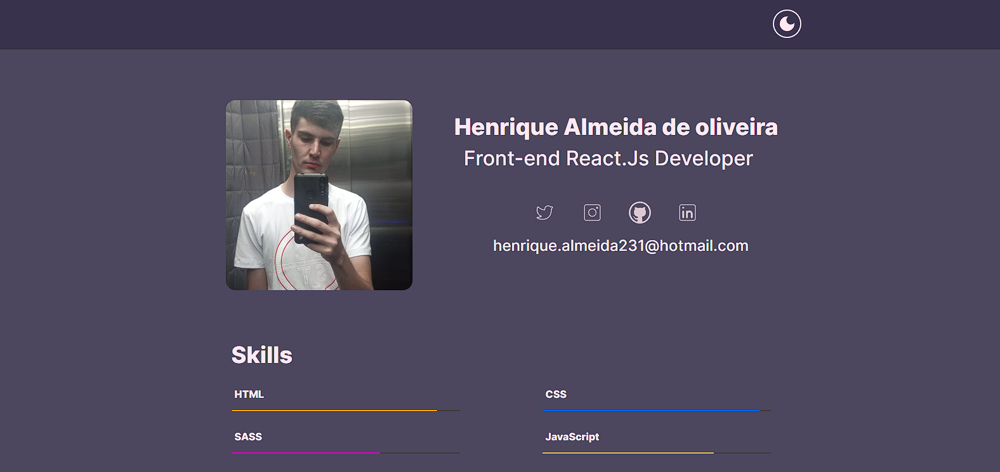
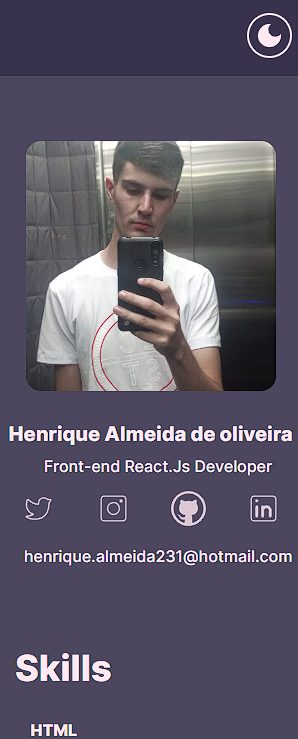

##Portfolio.

#Bem-vindo ao meu portfólio front-end! Este repositório contém uma coleção de projetos que desenvolvi para demonstrar minhas habilidades em desenvolvimento web. Cada projeto apresenta uma variedade de tecnologias e técnicas de design que utilizo em meu trabalho diário, incluindo HTML, CSS, JavaScript e React, entre outros.

#Cada projeto foi cuidadosamente desenvolvido para mostrar minhas habilidades em front-end e demonstrar minha capacidade de criar interfaces de usuário atraentes e funcionais. Você encontrará projetos de sites corporativos, landing pages, e-commerces, entre outros. Além disso, cada projeto possui um arquivo README que fornece informações detalhadas sobre as tecnologias utilizadas, instruções de instalação e uso, e como contribuir com o projeto.

#Sinta-se à vontade para explorar meus projetos, fornecer feedback ou entrar em contato comigo caso tenha alguma dúvida ou sugestão. Agradeço por visitar meu portfólio front-end!

##Desktop:

##Mobile:

